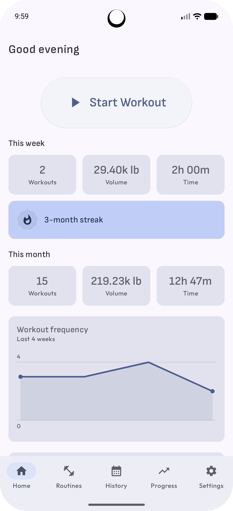
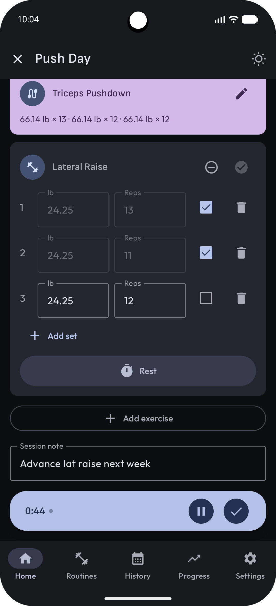
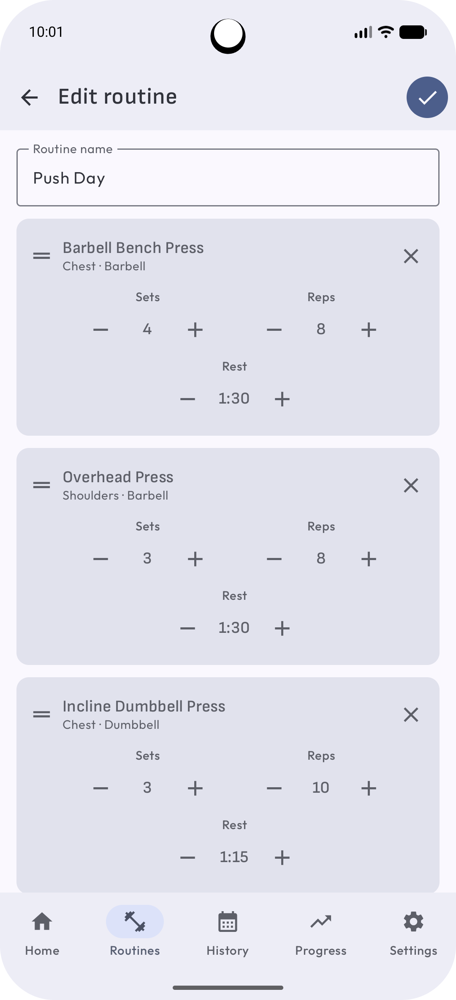
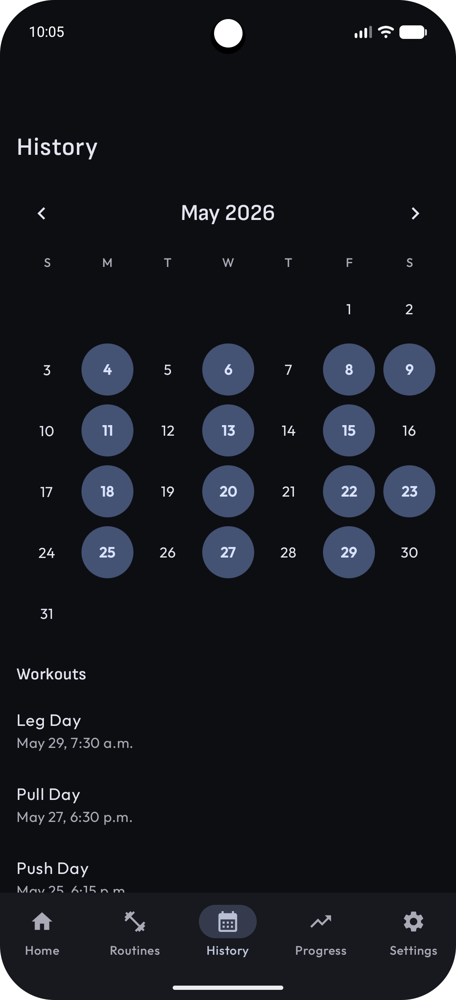
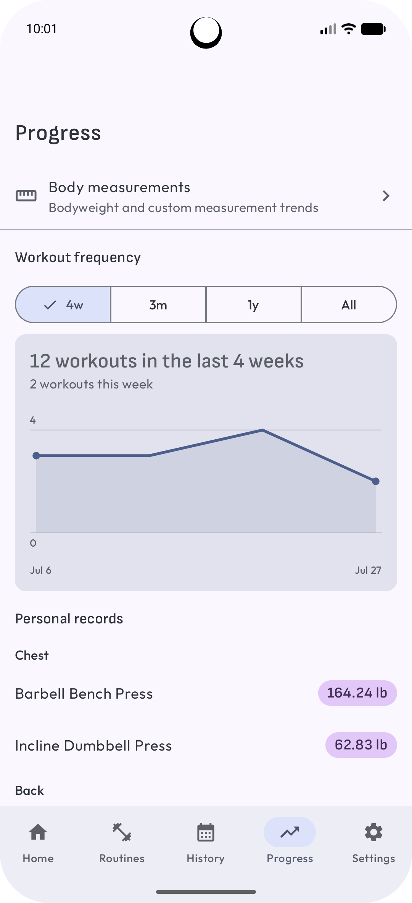
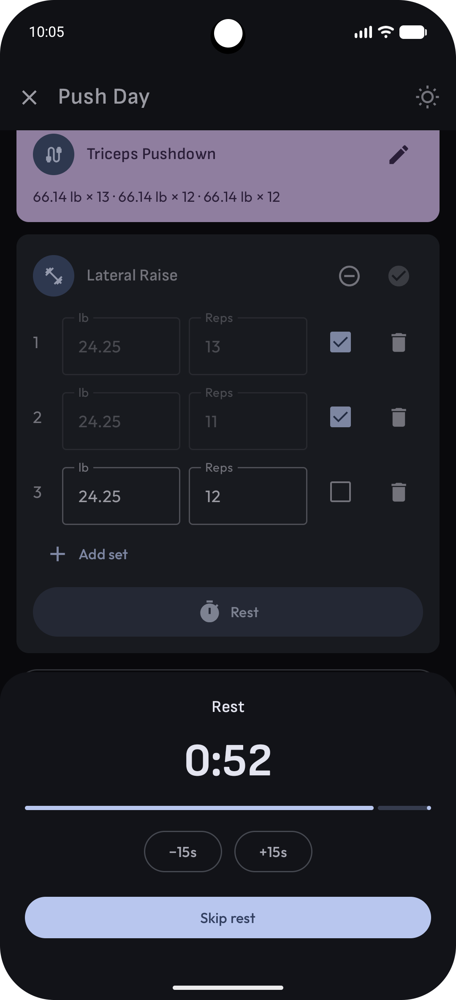
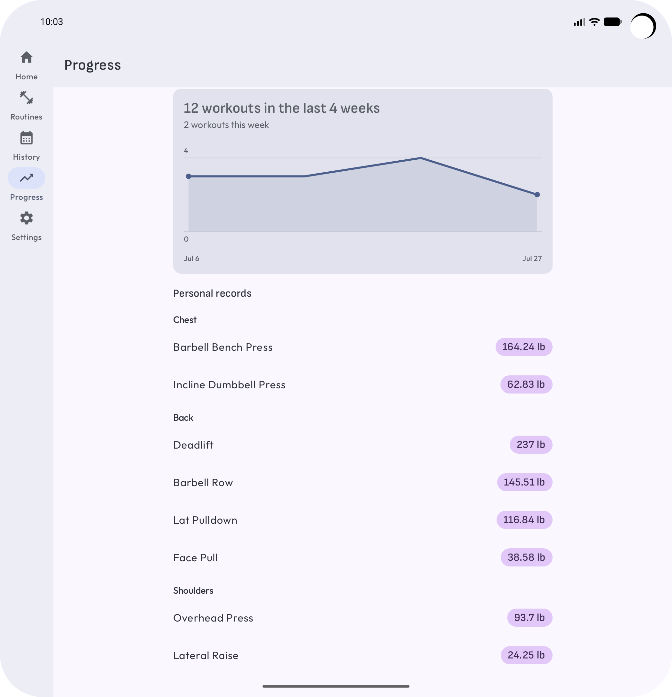

# Regimen

Regimen is a local-only Android gym-tracking application. Users define workout **routines**
(templates) in advance, then record actual **sessions** against them: sets, reps, and weight,
plus optional cardio. There is no backend, account system, or network dependency; all data
resides on the device.

## Features

- Template-driven logging: routines are built ahead of time, and workouts start from them with
  the previous session's numbers pre-filled.
- A freeform Quick workout entry point for established users who don't want to log against a
  routine.
- Active Workout runs behind a foreground service with a persistent pause/end notification, and
  survives process death.
- Cardio activities (treadmill, running, cycling, etc.) log duration and distance into any
  session.
- History is a calendar of past workouts; a session can be repeated or saved back as a routine.
- Progress tracks personal records and a workout-frequency chart.
- Body measurements track bodyweight and user-defined custom measurement types over time.
- A curated built-in exercise library, extendable with custom exercises.
- Material 3 Expressive UI with dynamic color, light/dark theming, and a metric/imperial unit
  preference (weight and distance are stored canonically and converted only for display).

## Screenshots

  
  
  
  
  
  

Regimen also adapts to foldables and other large screens:

  

## Architecture

Multi-module Gradle project: `:app` is the composition root. `:core:domain`, `:core:data`,
`:core:common-ui`, `:core:designsystem`, and `:core:navigation-api` hold shared layers. Each
screen or tab lives in its own `:feature:*` module (`settings`, `onboarding`, `exercise`,
`measurements`, `progress`, `routines`, `history`, `home`, `active`). A `build-logic` included
build supplies convention plugins that centralize each module's Compose/Hilt/Kotlin setup.

The architecture is MVVM + UDF with a full use-case (domain) layer: UI (feature modules) calls
domain, domain calls the data layer's repositories, repositories call Room DAOs. ViewModels
expose `StateFlow` UI state. Hilt provides dependency injection throughout.

**[`docs/architecture.md`](docs/architecture.md)** is the source of truth for the screen
inventory, navigation, the Active Workout spec, the data model, and the key product and
technical decisions. Read it before making structural changes.

## Testing

Fakes-first: in-memory, real-behavior fakes of `:core:domain`'s repository interfaces are the
default over mocking. JUnit4 throughout, Turbine for `Flow`/`StateFlow` assertions, and
`kotlinx-coroutines-test` for virtual-time control of `viewModelScope`. Room DAO tests and
Compose UI tests run on a real device/AVD (`androidTest`), not Robolectric. Coverage-percentage
targets are not a goal - tests are picked for specific logic worth protecting (branching use
cases, ViewModels with derived state, DAO joins, shared UI components).

**[`docs/testing.md`](docs/testing.md)** is the reference for what's tested, where each tier
lives, and what's deliberately left untested. Read it before writing new tests.

## Tech stack

- Kotlin, Gradle Kotlin DSL, version catalog, KSP
- Jetpack Compose + Material 3 Expressive, single-Activity
- Navigation Compose (type-safe routes)
- Room for local persistence (Coroutines / Flow)
- Hilt for dependency injection
- minSdk 26 (Android 8)

## Building

Open the project in Android Studio and run the `app` configuration on a device or emulator
running Android 8.0 (API 26) or later, or build from the command line with `./gradlew
:app:assembleDebug`.

## License

MIT - see [LICENSE](LICENSE).
